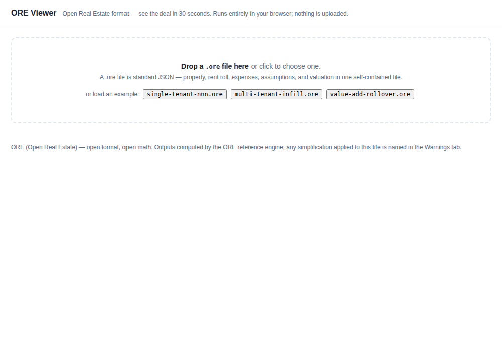
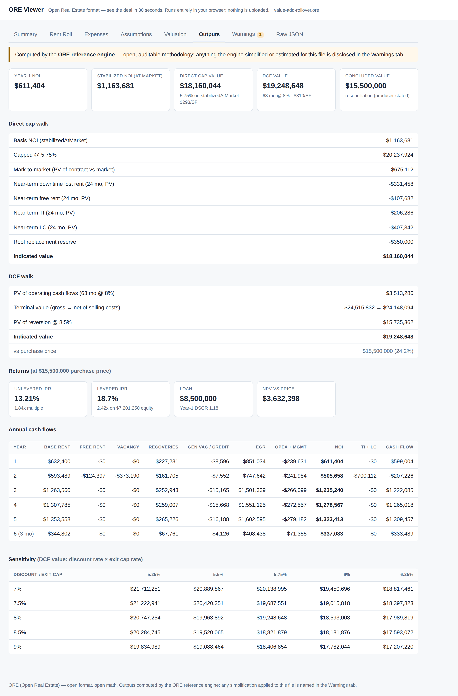

# ORE — Open Real Estate Format

**An open, JSON-based file format for commercial real estate underwriting data, and
an open-source reference engine that computes it.**

> Deal data should belong to the deal, not to any software license.



<p align="center"><em>Drop a <code>.ore</code> file into the <a href="demo/">viewer</a> and the whole deal renders — property, rent roll, NOI, DCF, returns, sensitivity — with zero re-keying. No install, no upload, no license.</em></p>

## The problem

Every CRE transaction moves the same underlying data — rent rolls, lease abstracts,
operating histories, underwriting assumptions — between brokers, buyers, and
appraisers. Today that data travels in formats that force manual re-keying at every
hand-off. Errors compound, hours evaporate, and no two parties can verify they are
computing the same NOI from the same inputs.

## What ORE is

1. **A published file format** (`.ore`, standard JSON) with a versioned JSON Schema
   anyone can implement, free forever. Machine-readable by design, LLM-native, with
   calculation assumptions traveling *with* the data — one self-contained file per deal.
2. **A reference calculation engine** (TypeScript) producing standardized outputs —
   NOI, cash flows, DCF, direct cap, debt, IRR, sensitivity — so any conforming
   implementation reproduces identical results from the same file. Auditable math,
   line by line.

The model is PDF, not a software product: any tool can produce the format, any tool
can consume it, and no one owns it.

## See it in 30 seconds

```bash
git clone https://github.com/graham1776/Open-Real-Estate.git
cd Open-Real-Estate
npm install        # ajv, for schema validation
npm run demo       # opens the viewer at http://localhost:8080/demo/
```

Then drag any file from [`examples/`](examples/) onto the page. (The viewer is a
static page with no backend — your deal file never leaves your machine.)

Prefer the terminal? A `.ore` file is just JSON:

```bash
cat examples/single-tenant-nnn.ore | jq .property.name
npm test           # builds the engine, validates examples, reproduces golden outputs
```

## What a `.ore` file carries

One JSON document, seven modules — `property` and `rentRoll` required, the rest
optional so a file carries exactly what its producer knows:

| Module | Holds |
|---|---|
| `property` | Identity, location, industrial physicals (SF, clear height, docks, power) |
| `rentRoll` | Leases with stepped rent, escalations, NNN/NN/MG/Gross, free rent, TI/LC, options; vacant suites |
| `expenses` | Operating expenses with recoverability flags and growth |
| `marketAssumptions` | Market rent, growth curves, downtime, renewal probability, market TI/LC |
| `valuation` | DCF, direct cap, sales comparison, cost — assumptions travel with the data |
| `debt` | Optional loan terms for levered returns |
| `provenance` | Who produced the file, when, from what sources |

Full field-by-field reference: the [spec](spec/README.md) and
[data dictionary](spec/data-dictionary.md). For LLMs and agents, the entire format
is published as a single ingestible document: [`llms.txt`](llms.txt).

## Status

**Pre-v0.1.** Current scope: US industrial (single- and multi-tenant). See [ROADMAP.md](ROADMAP.md).

| Component | Where | State |
|---|---|---|
| Format spec & JSON Schema | [`spec/`](spec/) | All v0.1 modules drafted |
| Reference engine (TypeScript) | [`engine/`](engine/) | Working: full cash model, valuation, debt, returns, sensitivity; goldens locked (`npm test`) |
| Viewer / demo | [`demo/`](demo/) | Working: drag a `.ore` file → summary, rent roll, outputs, warnings (`npm run demo`) |
| Example deal files | [`examples/`](examples/) | Three examples, all validating (`npm run validate`) |
| LLM ingestible spec | [`llms.txt`](llms.txt) | Published |
| Validator (CLI + browser) | [`validator/`](validator/) | Example-validation script; standalone CLI not started |
| Documentation site | [`docs/`](docs/) | Decision and design notes; site not started |

## Why the math is open too

A format alone would let every tool disagree about NOI. ORE ships a reference engine
whose outputs are **locked by golden files** — every example deal has expected
outputs checked into the repo, and conformance means reproducing them exactly. The
engine also treats uncertainty as a feature: when a file is ambiguous or the engine
estimates something, it says so in a first-class `warnings` output rather than
projecting false precision.

From one `.ore` file, the engine produces the full underwriting — direct cap and DCF
walks, levered/unlevered returns, an annual cash flow table, and a sensitivity grid:



## Contributing

Issues and PRs welcome — edge-case arguments are a feature; they harden the spec.
See [CONTRIBUTING.md](CONTRIBUTING.md) and [GOVERNANCE.md](GOVERNANCE.md).

## License

[Apache 2.0](LICENSE).
